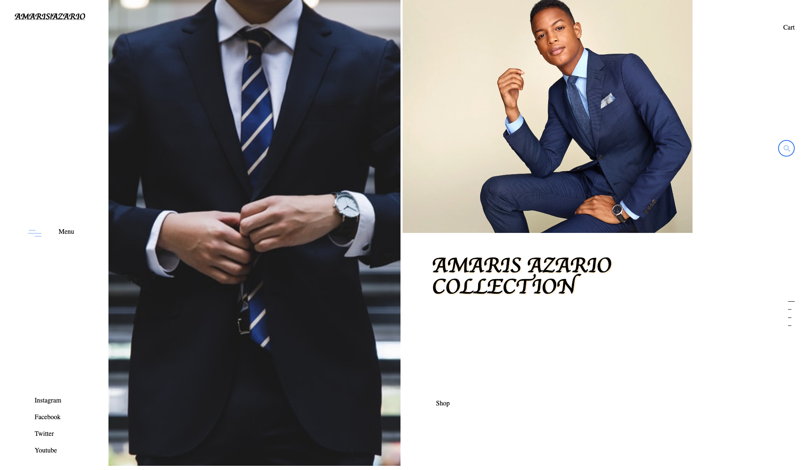

# Capstone-project-sneakers-shop

> In this project, I created Amaris Azario Collection a clothing store webpage similar to the layout or that of the sneaker shop all pages are responsive and have a few animated transitional effects.

For this project, I use HTML and CSS, Flexbox and CSS grid systems to build the page, construct the layout and to style the page.

features that I'm proud of is the navbar that I made with pure CSS and HTML

## Built With

- HTML, CSS, Flexbox, CSS Grid

## Live Demo

[Live Demo Link](https://rawcdn.githack.com/aulbytj/Capstone-project-sneakers-shop/a0fef9bb12ae7ed9734811b95659edbdd858ac62/index.html)

## Getting Started

**This is an example of how you may give instructions on setting up your project locally.**
**Modify this file to match your project, remove sections that don't apply. For example: delete the testing section if the currect project doesn't require testing.**

To get a local copy up and running follow these simple example steps.

A copy of my project can be cloned from the prject repo

## Authors

👤 **Aulbourn Knowles**

- Github: [@githubhandle](https://github.com/aulbytj)
- Twitter: [@twitterhandle](https://twitter.com/aulbytj)
- Linkedin: [linkedin](https://linkedin.com/in/aulbourn-knowles-b9971672)

## 🤝 Contributing

Contributions, issues and feature requests are welcome!

Feel free to check the [issues page](https://github.com/aulbytj/Capstone-project-sneakers-shop/issues).

## Show your support

Give a ⭐️ if you like this project!

## Acknowledgments

- Microverse

## 📝 License

This project is [MIT](lic.url) licensed.
